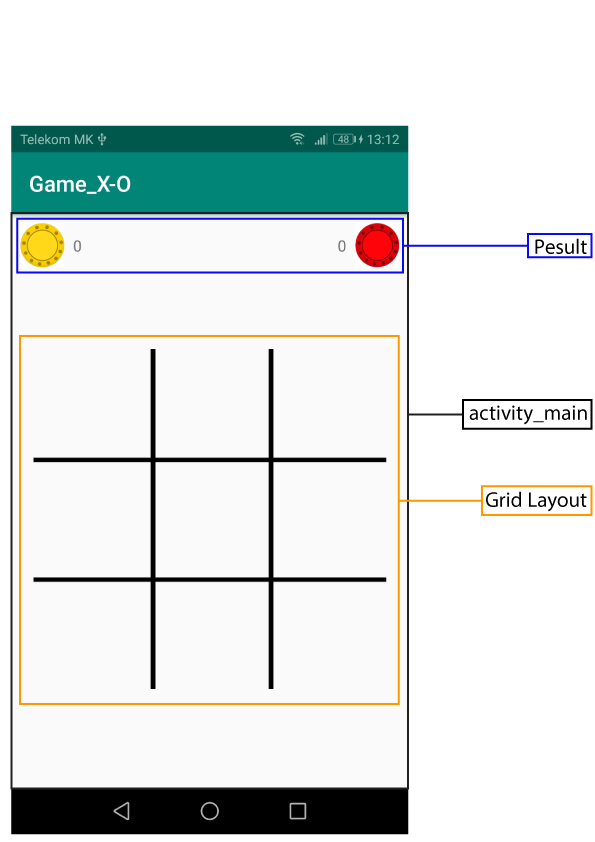
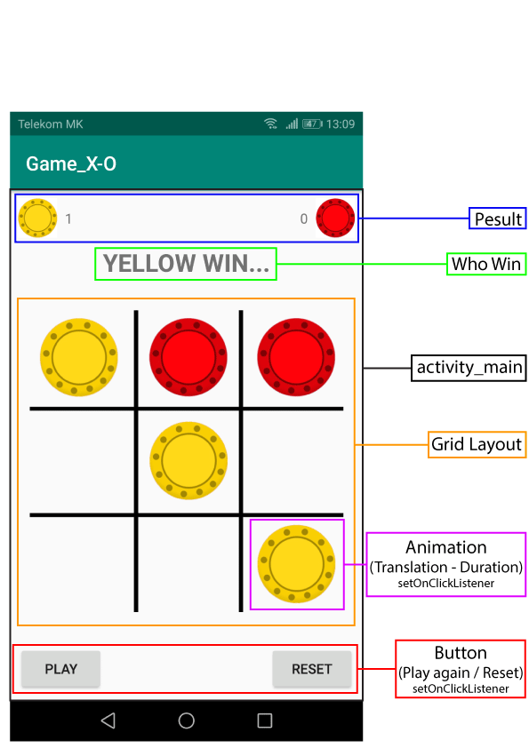

# Android_Game_Tic-Tac-Toe
Game Tic-Tac-Toe or X-0

## Description

  ### 1. Usaged
   - Grid Layout
   - Matrix
   - Animation (Translation - Duration)
   - Visibility (Invisible / Visible)
      
  ### 2. Create:                          
   **Class:**
   - MainActivity.class   
   
  **layout:**
   - activity_main.xml
  
 
  ### 3. Screenshot / Concept:
    _______ 

  ### 4.Demo:
 

## Author: Nikola Petkovik
  ### contact:
   - Gmail: nikolapetkovik86@gmail.com
   
